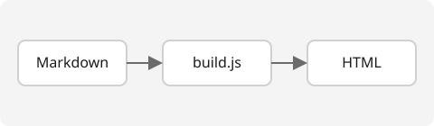

## 배경

요즘은 블로그 하나 만들 때도 React 기반 프레임워크를 쓰는 경우가 많습니다.
하지만 이 프로젝트는 일부러 프레임워크를 쓰지 않았습니다.

## 이유

### 1. 학습 목적

빌드 도구 뒤에 무엇이 있는지 직접 만들어보며 이해하고 싶었습니다.

### 2. 가벼움

결과물은 순수 HTML/CSS/JS 파일뿐이라 어디서든 바로 열립니다.

### 3. 충분한 기능

블로그에 필요한 건 마크다운 변환, 목록 페이지, 다크 모드 정도입니다.
아래는 전체 흐름을 나타낸 간단한 다이어그램입니다.

## 마치며

작은 도구로도 충분히 괜찮은 결과를 낼 수 있다는 걸 보여주고 싶었습니다.
